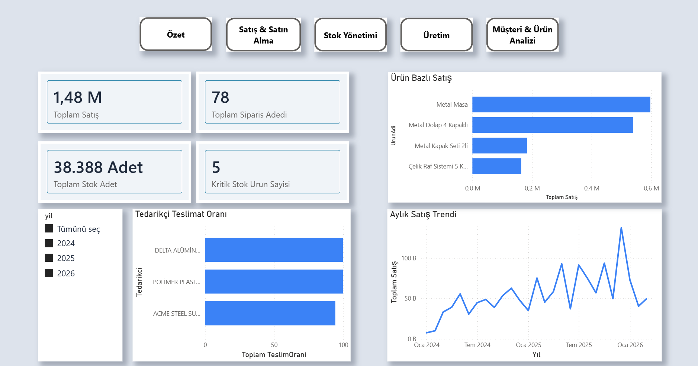
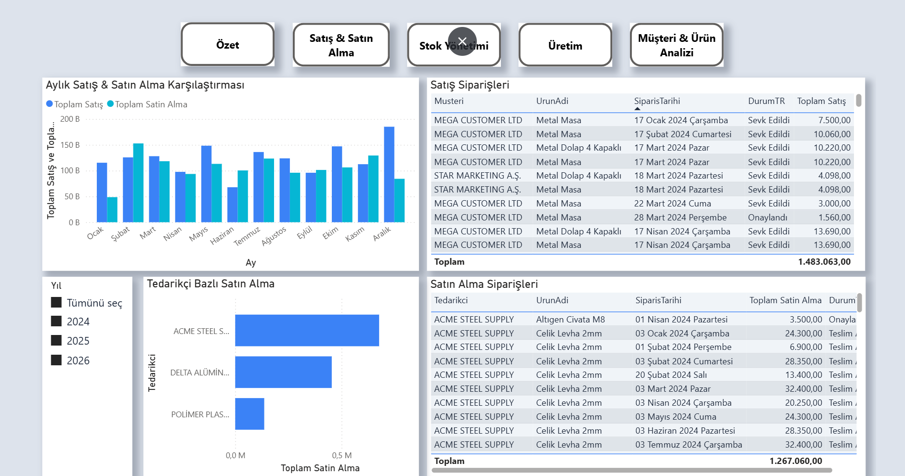
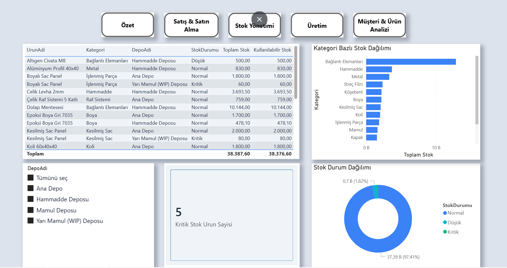
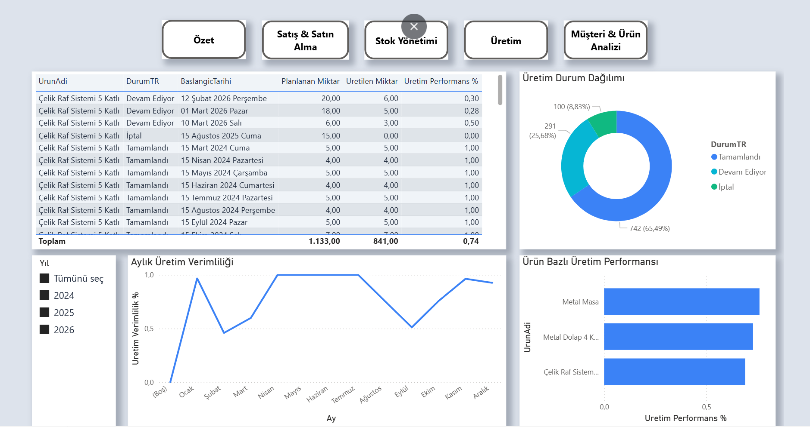
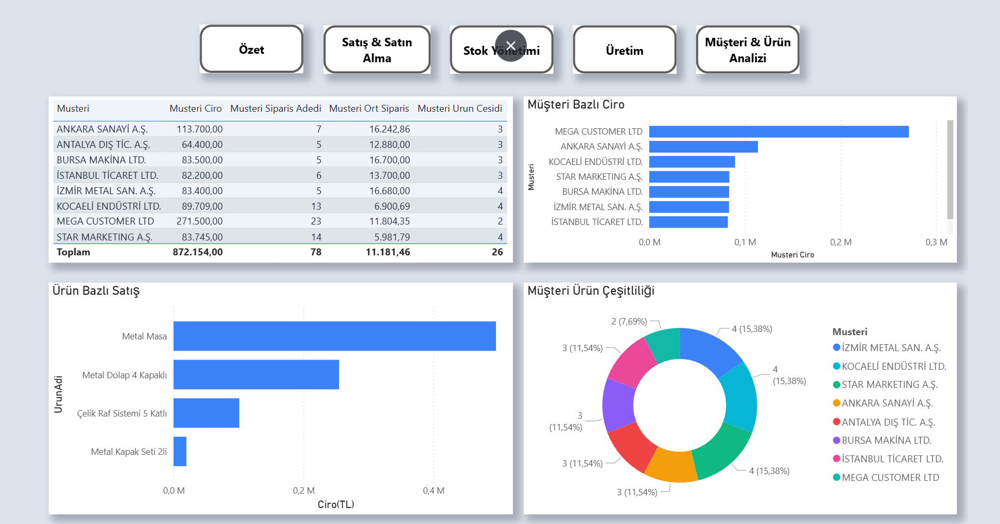

<div align="center">

# Supply Chain Analytics Platform

**End-to-end supply chain intelligence — from normalized SQL database to Power BI dashboards and ML-driven demand forecasting.**

[](https://www.microsoft.com/sql-server)
[](https://powerbi.microsoft.com)
[](https://python.org)
[](https://scikit-learn.org)

</div>

---

## Overview

This project simulates a real-world Supply Chain Management system across **4 regional branches** in Turkey. It covers the full analytics stack:

- **Database layer** — fully normalized SQL Server schema with stored procedures, triggers, and views
- **Reporting layer** — interactive Power BI dashboard with Row Level Security (RLS)
- **ML layer** — synthetic data generation + demand forecasting model (in progress)

---

## Dashboard

> 5-page Power BI report. Each branch (Istanbul, Ankara, Izmir, Bursa) sees only its own data via RLS.

<table>
  <tr>
    <td align="center"><b>Özet</b></td>
    <td align="center"><b>Satış & Satın Alma</b></td>
  </tr>
  <tr>
    <td></td>
    <td></td>
  </tr>
  <tr>
    <td align="center"><b>Stok Yönetimi</b></td>
    <td align="center"><b>Üretim</b></td>
  </tr>
  <tr>
    <td></td>
    <td></td>
  </tr>
  <tr>
    <td align="center" colspan="2"><b>Müşteri & Ürün Analizi</b></td>
  </tr>
  <tr>
    <td colspan="2" align="center"></td>
  </tr>
</table>

| Page | Visuals |
|---|---|
| **Özet** | KPI cards, production completion gauge, monthly trend |
| **Satış & Satın Alma** | Sales waterfall, trend line, purchasing funnel by status |
| **Stok Yönetimi** | Treemap by category, stock bar chart, critical stock alerts |
| **Üretim** | Status pie, planned vs actual comparison |
| **Müşteri & Ürün Analizi** | Scatter (RFM), customer ranking, product revenue breakdown |

**RLS Roles:** `IST-001` Istanbul · `ANK-001` Ankara · `IZM-001` Izmir · `BRS-001` Bursa

---

## Machine Learning — Demand Forecasting

To enable predictive analytics, 2 years of synthetic sales data (2022–2023) was programmatically generated to complement real 2024 data.

### Data Generation Pipeline

```
generate_demand_data.py
  → Seasonality weights (Nov–Dec peak, Jan–Feb low)
  → Branch weights   (Istanbul 1.4x, Bursa 0.75x)
  → Year-over-year growth trend (2022: 0.75x → 2023: 0.90x → 2024: 1.0x)
  → ±20% random noise per order
  → INSERT into SalesOrder + SalesOrderItem (SQL Server)
  → Export to demand_data.csv
```

### Dataset

| Stat | Value |
|---|---|
| File | `python/demand_data.csv` |
| Rows | 905 (year × month × branch × product) |
| Period | Jan 2022 – Dec 2024 (3 years) |
| Orders | 2022: 193 · 2023: 204 · 2024: actual |
| Features | `yil, ay, subeKodu, productID, productName, categoryName, toplamMiktar, toplamCiro, siparisAdet` |

### Planned Model

- **Algorithm:** XGBoost (primary) + Facebook Prophet (seasonal baseline)
- **Target:** `toplamMiktar` — monthly demand per product per branch
- **Features:** month, branch, category, lag values, rolling averages, seasonality flags
- **Output:** Next-month demand forecast with confidence interval

---

## Database

**Platform:** SQL Server Express · **Instance:** `ENES\SQLEXPRESS` · **Database:** `SCM_3`

### Schema

| Module | Tables |
|---|---|
| Geography | `Country`, `City`, `Town`, `District`, `Address` |
| Partners | `BusinessPartner`, `BusinessPartnerRole`, `BusinessPartnerAddress` |
| Products | `Unit`, `ProductCategory`, `Product`, `BOM`, `BOMItem` |
| Warehouse | `Warehouse`, `InventoryBalance`, `StockMovement` |
| Purchasing | `PurchaseOrder`, `PurchaseOrderItem`, `GoodsReceipt`, `GoodsReceiptItem` |
| Sales | `SalesOrder`, `SalesOrderItem`, `Shipment`, `ShipmentItem` |
| Production | `ProductionOrder`, `ProductionConsumption`, `ProductionOutput` |
| Branch | `Sube`, `SubeKullanici` |
| Time | `DimTarih` (date dimension) |

### Status Flows

```
PurchaseOrder:   DRAFT → APPROVED → PARTIALLY_RECEIVED → RECEIVED → CANCELLED
SalesOrder:      DRAFT → APPROVED → RESERVED → PARTIALLY_SHIPPED → SHIPPED → CANCELLED
ProductionOrder: DRAFT → RELEASED → IN_PROGRESS → COMPLETED → CANCELLED
```

### Key Technical Features

| Feature | Detail |
|---|---|
| **Stored Procedures** | `CreatePurchaseOrder`, `PostGoodsReceipt`, `ReserveSalesOrder`, `PostShipment`, `PostProductionOutput` |
| **Triggers** | `TR_StockMovement_UpdateInventoryBalance` — auto-updates inventory, blocks negative stock |
| **Views** | 11 Power BI-ready views with Turkish labels, branch joins, and status translations |
| **RLS** | 4 branch roles enforced via DAX filter on `Sube` table |
| **Conditional Formatting** | Stock status (Critical / Low / Normal) driven by `minStockLevel` per product |
| **Data Volume** | 2022–2024: ~600 sales orders, ~1,800 order items, 272+ stock movements |

---

## Project Structure

```
supply-chain-analytics/
│
├── database/
│   ├── seed-data/               # Master & transactional INSERT scripts
│   ├── views/                   # 11 Power BI-optimized SQL views
│   ├── stored-procedures/       # Business logic (T-SQL)
│   └── tests/                   # Validation scripts
│
├── powerbi/
│   └── SCM_SupplyChain_Dashboard.pbix
│
├── python/
│   ├── generate_demand_data.py  # Synthetic data generator
│   └── demand_data.csv          # ML training dataset (905 rows, 3 years)
│
├── docs/
│   └── screenshots/             # Dashboard page screenshots
│
└── README.md
```

---

## Author

<div align="center">

**Enes İbiş**

[](https://www.linkedin.com/in/enesibis/)
[](https://github.com/Enesibis)

</div>
